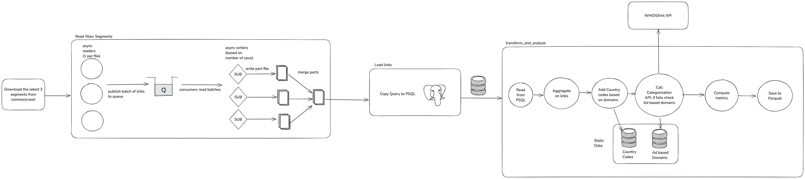

# CommonCrawl challenge

## Summary

This challenge involves reading 3 WARC segments from commoncrawl.org and process them. This is done using asyncio, multithreading and Polars, running everything in an airflow pipeline.

### Overview of the pipeline

## How to run this project

### Pre-requisites

* Make sure you have at least Python 3.12 installed
* Install [uv](https://docs.astral.sh/uv/getting-started/installation/), if you don't have it on your system, since it's used as package manager for this project.
* docker-compose

### Setup

* Create a free account on [WhoisXMLAPI](https://whois.whoisxmlapi.com/), get an API key and paste it in the appropriate environment variable in your .env

### Run on local hosted airflow

* Create an airflow.env file using example.env as base. This file will be mounted as env file while running docker-compose
* `make run-airflow`, will set up an airflow instance running on docker, together with the db (**NOTE:** you will be asked for your password as you need to chmod the /tmp folder used as staging area)
* Wait a couple of minutes for the initialization to succeed
* Access `localhost:8080` with the credentials `admin:admin`
* Enable the `cc_pipeline_dag`
* Run it manually, parameters will default to `year=2025` and `week=13`
* The output datasets will be saved in the `./output` folder:
  * `external_links.parquet` (partitioned by `country_code` and `category`)
  * `ad_based_ratio.parquet`
  * `ad_domain_by_country.parquet`
  * `category_coverage.parquet`
  * `links_by_category.parquet`
  * `top_countries.parquet`

**NOTE:**: You can use the variable MAX_LINKS_PER_FILE to limit the number of links to be extracted from every WARC file.

### Performances

On my computer, the whole pipeline takes around 1 hour to run end to end.

## TODO for production readiness

1. Proper secret management via environment variables injection: for simplicity purpose I am hardcoding all passwords
2. Regularly update data/hosts for ad based domain detection
3. Have a sensor triggering the airflow pipeline whenever a new partition is detected
4. Use S3 to download the files
5. Use Spark to scale on parallelization and distributed computing if there's the need to compute the whole commoncrawl dataset, possibly ingesting directly from S3 bucket provided by commoncrawl
